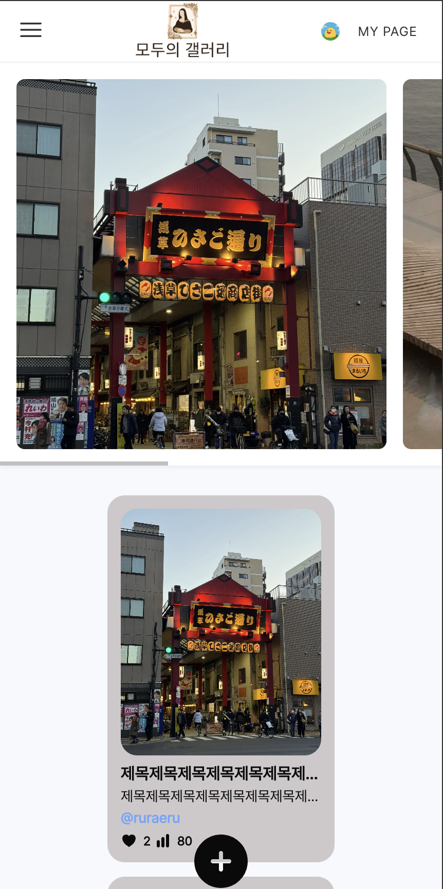
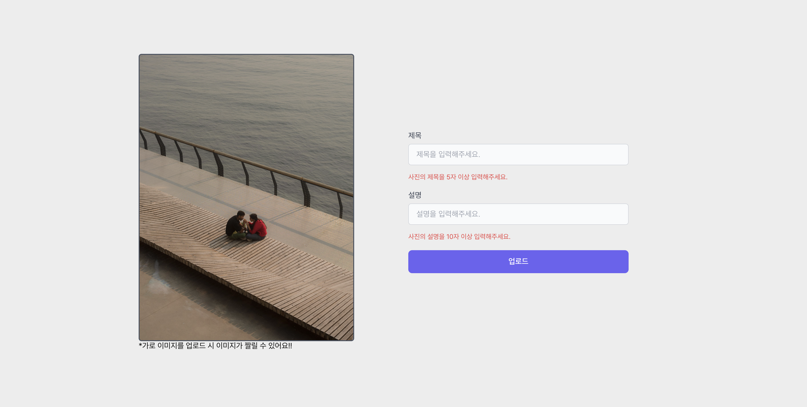
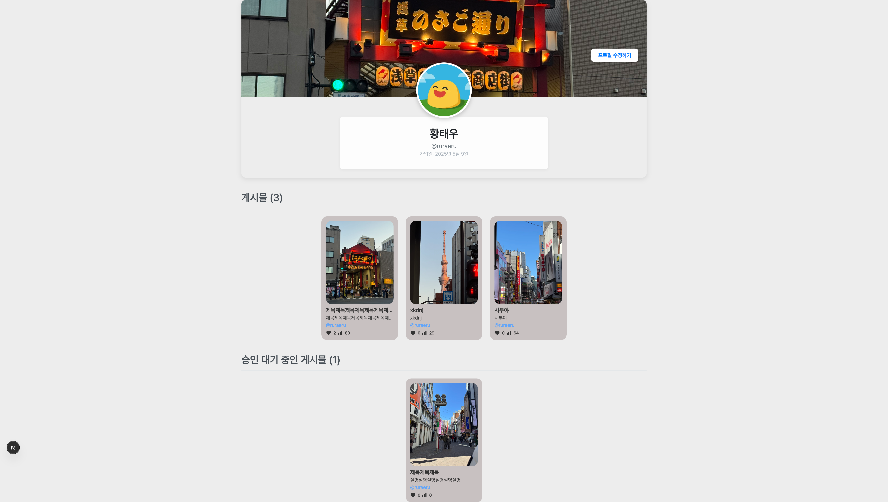
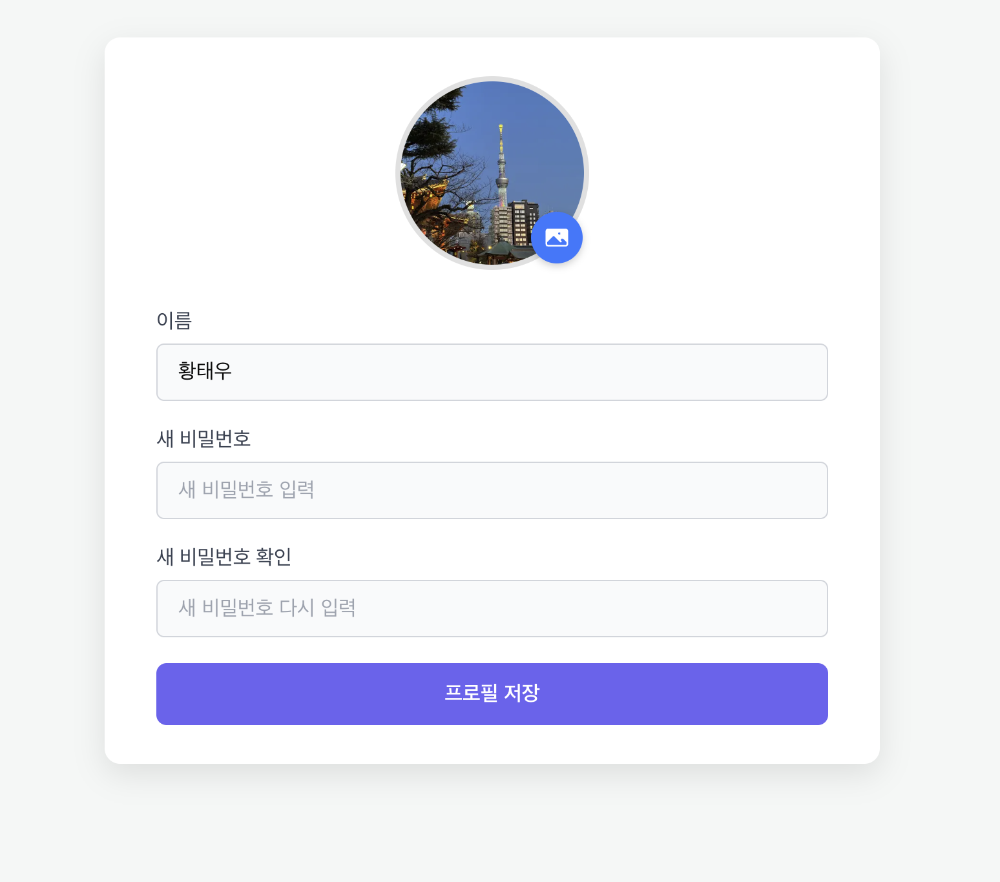
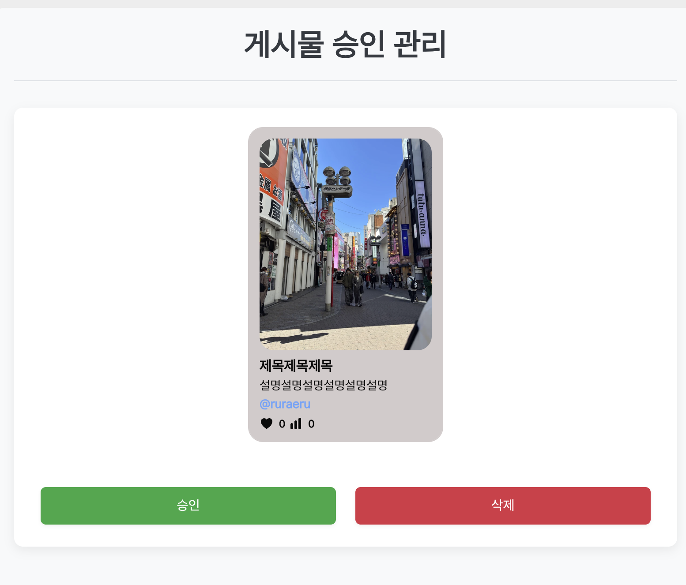

# Gallery Front

Next.js 기반의 사진/이미지 갤러리 웹 애플리케이션입니다. 사용자는 이미지를 업로드하고, 게시글을 작성하며, 좋아요 및 조회수 기능을 통해 상호작용할 수 있습니다. 회원가입, 로그인, 마이페이지, 관리자 기능 등 다양한 기능을 제공합니다.

### 화면 구성

|                    메인                     |
| :-----------------------------------------: |
|   |
| 상단 배너의 게시물들은 좋아요 순으로 정렬됨 |

|                 모바일 메인                  |
| :------------------------------------------: |
|  |
|       상단 헤더가 햄버거 메뉴로 변경됨       |

|                                        게시물                                        |
| :----------------------------------------------------------------------------------: |
|                                     |
| 게시물 상세 페이지 게시물에 좋아요를 눌러 상호작용 가능하고 조회수를 확인할 수 있다. |

|                   게시물 업로드                   |
| :-----------------------------------------------: |
|  |
|       zod를 통해 입력폼의 유효성 검사를 함        |

|                                유저 프로필                                 |
| :------------------------------------------------------------------------: |
|                                |
| 본인의 프로필이라면 프로필 수정 버튼과 승인 대기 중인 게시물 영역이 보여짐 |

|                    프로필 수정                    |
| :-----------------------------------------------: |
|  |
|  유저의 아바타, 이름, 비밀번호를 수정할 수 있다.  |

|                                    관리자 페이지                                    |
| :---------------------------------------------------------------------------------: |
|                                      |
| 유저가 업로드한 게시물에 대한 검열을 통해 조금 더 청결하게 플랫폼을 관리할 수 있다. |

## 미들웨어

```typescript
import { NextRequest, NextResponse } from "next/server";
import getSession from "./lib/session";

interface Routes {
  [key: string]: boolean;
}

const publicOnlyUrls: Routes = {
  "/": true,
  "/login": true,
  "/signup": true,
};

export async function middleware(req: NextRequest) {
  const session = await getSession();
  const exists = publicOnlyUrls[req.nextUrl.pathname];
  if (!session.id) {
    if (!exists) {
      return NextResponse.redirect(new URL("/signup", req.url));
    }
  }
}

export const config = {
  matcher: ["/((?!api|_next/static|_next/image|favicon.ico|.*\\..*).*)"],
};
```

`미들웨어`를 통해 로그인 여부를 확인하고 허용된 경로에만 접근할 수 있게 함.

## 주요 기능

- **메인 페이지**: 최신 이미지 게시글 목록, 배너, 로그인 상태에 따라 글쓰기 버튼 노출
- **게시글**: 이미지, 제목, 설명, 작성자, 좋아요, 조회수 표시 및 상세 페이지 제공
- **게시글 작성/수정/삭제**: 로그인한 사용자는 이미지를 업로드하고 게시글을 작성/수정/삭제 가능
- **회원가입/로그인/로그아웃**: iron-session 기반 인증
- **마이페이지**: 유저 정보 확인, 수정 및 승인/대기 게시물 확인
- **관리자 페이지**: 전체 게시글 및 유저 관리(관리자 권한 필요)
- **반응형 디자인**: 모바일, 태블릿, 데스크톱 환경에서 최적화된 UI 제공

## 폴더 구조

```
 src/
       app/
         (tabs)/
           (main)/      # 메인(홈) 페이지
           posts/       # 게시글 목록, 상세, 작성
           users/       # 유저 프로필, 수정
           admin/       # 관리자 페이지
         (auth)/        # 로그인, 회원가입
       components/      # UI 컴포넌트
       service/         # API/비즈니스 로직
       styles/          # CSS 모듈
       lib/             # 유틸리티, 세션 등
       types/           # 타입 정의
```

## 기술 스택

- **Framework**: Next.js 15
- **Language**: TypeScript, React 19
- **DB/ORM**: Prisma, @prisma/client
- **UI**: CSS Modules, @heroicons/react
- **인증**: iron-session
- **기타**: zod(유효성 검사)

## 설치 및 실행

1. 패키지 설치

   ```bash
   npm install
   ```

2. 개발 서버 실행

   ```bash
   npm run dev
   ```

3. 빌드 및 배포
   ```bash
   npm run build
   npm start
   ```

## 환경 변수

- 데이터베이스, 세션 등 환경 변수는 `.env` 파일에 별도 설정 필요

```js
DATABASE_URL = "mysql://(계정명):(비밀번호)@(호스트):(포트)/(데이터베이스)";

COOKIE_PASSWORD = "(랜덤스트링)";
```
